# R.E.A.D. AWS

**Reading Educator Assistance Desk**: a proof of concept for the AI Innovation Hub /
Mississippi Department of Education. K-5 teachers ask Science of Reading questions and get
answers grounded only in openly licensed research, with every quotation checked word for word.
They can also upload sample teaching material and get a review that shows its evidence: the
material's own words, what the research says, and research-backed ways to improve.

Built on AWS: Amazon Bedrock (Titan Text Embeddings V2, Amazon Rerank 1.0, Amazon Nova Pro),
DynamoDB, S3 (including the search index, searched in memory), and Lambda behind API Gateway,
deployed with AWS SAM. No Docker, no database server.

> **Status:** deployed on AWS (stack `read-poc`, 2026-10-09) behind a shared passcode. The review checklist is a development
> placeholder until the subject-matter expert rewrites it. Full design: [`docs/design.md`](docs/design.md);
> decisions D1–D95: [`docs/decisions.md`](docs/decisions.md); session log:
> [`docs/progress.md`](docs/progress.md).

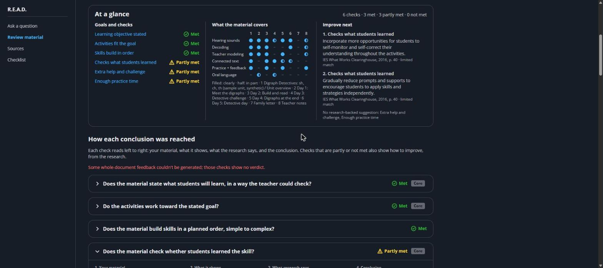

## What R.E.A.D. guarantees

These rules are enforced in code, not left to the language model.

1. **Excerpts never pass through the model.** Research text is sliced from the stored source by
   character offsets; nothing the model returns is shown as a quote.
2. **Every excerpt is hash-checked** (`text_sha256`) before it is shown; a mismatch is logged and
   the excerpt dropped.
3. **The model cites IDs only** (`S1`, `S2` for research; `M1`, `M2` for the teacher's material).
   Source names, dates, and pages are rendered from metadata.
4. **Every answer is validated.** Each citation must exist, and any 8+ words reused from a source
   are shown as a verified quotation of that source. One retry, then an honest error.
5. **Sections are never truncated** to fit a budget; whole sections are dropped instead.
6. **License gate.** A source is searchable only after a person signs off its license.
7. **No student, teacher, or district data.** Review material must be sample material, is never
   indexed, and is deleted after 24 hours.
8. **Every answer shows** the advisory disclaimer, an evidence-strength flag, and the content date.
9. **Safe rendering.** Corpus and model text is placed with `textContent`, never `innerHTML`.

## Architecture

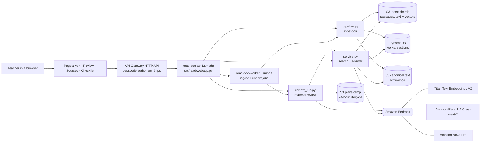

| Layer | AWS (stack `read-poc`, `template.yaml`) |
|---|---|
| Pages and API | One FastAPI app on Lambda (Mangum) behind API Gateway (HTTP API, 5 rps / burst 10); `/api/*` needs the shared passcode (Lambda authorizer, SSM SecureString) |
| Long jobs | Worker Lambda (async, 15 min) runs ingestion and reviews; state in S3 so any Lambda can report progress |
| Search index | One file per source version in S3 (passages + vectors), loaded into the Lambda and searched in memory: numpy cosine + BM25, fused like OpenSearch's hybrid-norm. No server, no idle cost; fits up to tens of thousands of passages |
| Metadata | DynamoDB `read-poc-works`, `read-poc-sections` (on demand) |
| Files | Private, encrypted S3: sources, canonical text (versioned, write-once), review material (deleted after a day), checklist |
| Models | Bedrock: Titan V2, Rerank 1.0 (us-west-2), Nova Pro, via least-privilege roles inside a permissions boundary |

The local dev server (`scripts/dev_server.py`) runs the same app against the deployed stack.

The answer model must be an Amazon model (Nova Pro). Everything uses IAM; there are no API keys.

## Capabilities

### Ask a question

Hybrid search (full text + vectors) finds candidate passages, reference lists are filtered out,
Amazon Rerank orders them, and whole sections are hash-checked before Nova Pro answers using
only those sections. Wording taken from a source is shown as a verified quotation, and each
citation opens the exact source text.

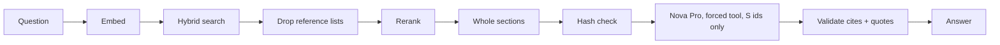

| | |
|---|---|
| 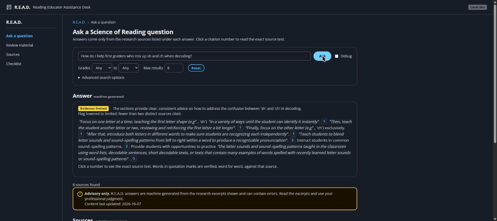 | 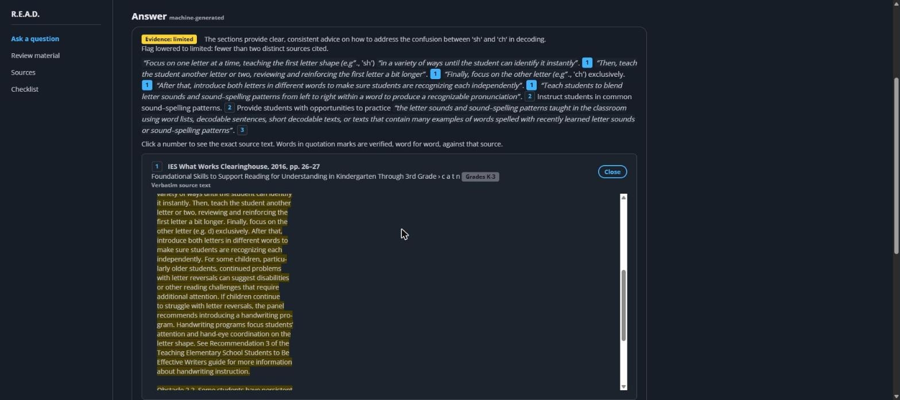 |

```python
# src/read/retrieve.py: the hash check every excerpt passes
def verified(evidence: list[dict]) -> list[dict]:
    """Keep only items whose text matches the stored hash; log every mismatch."""
    ok = []
    for e in evidence:
        sec = e["section"]
        if sha(e["text"]) != sec["text_sha256"]:
            log.error("integrity_failure section_id=%s ...", sec["section_id"])
            continue
        ok.append(e)
    return ok
```

### Sources and ingestion

The Sources page adds and manages research. Ingestion extracts text, splits it into sections
and ~250-word passages with exact character offsets (ingestion fails if any offset doesn't
reproduce its text), embeds and indexes them. A new source waits at `awaiting_license` and is
not searchable until a person signs off its license.

| | |
|---|---|
| 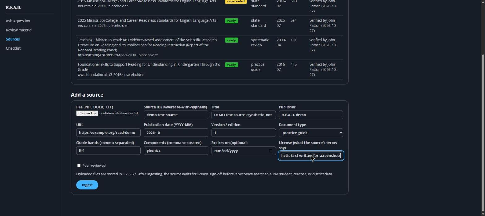 | 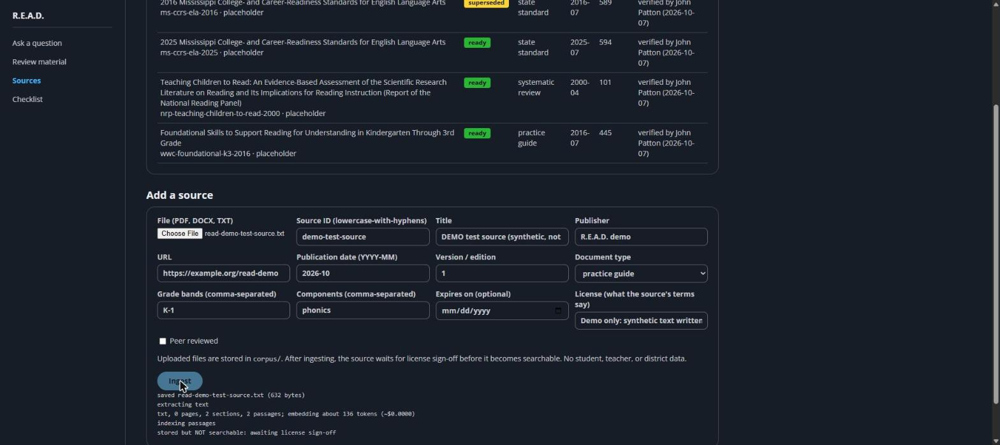 |
| 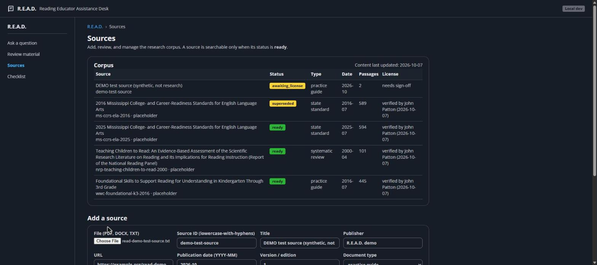 | 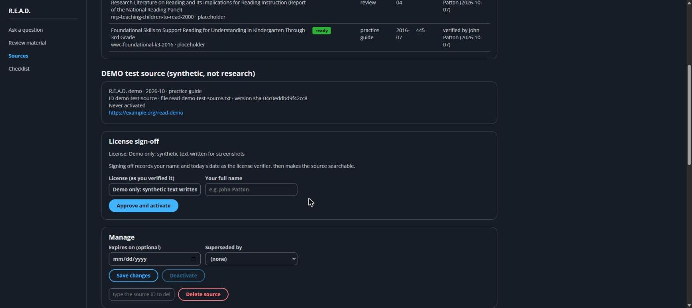 |

```python
# src/read/ingest.py: the license gate
LICENSE_FIELDS = ("license", "license_verified_by", "license_verified_on")

def license_ok(meta: dict) -> bool:
    """All three fields set by a person, with a real date. Drafts leave the
    verification fields empty, so they never pass."""
```

Reference lists, endnotes, and study tables (3+ author-year citations at 1.5+ per 100 words) are
excluded from search: 112 of 1,729 passages in the current library, none from guidance pages.

### The review checklist

The questions a review asks of every piece of material, editable on the Checklist page. It is a
**development placeholder**: the subject-matter expert must rewrite it before any teacher use.

| | |
|---|---|
| 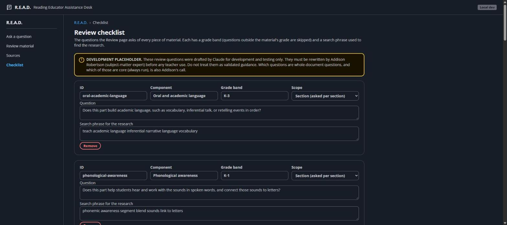 | 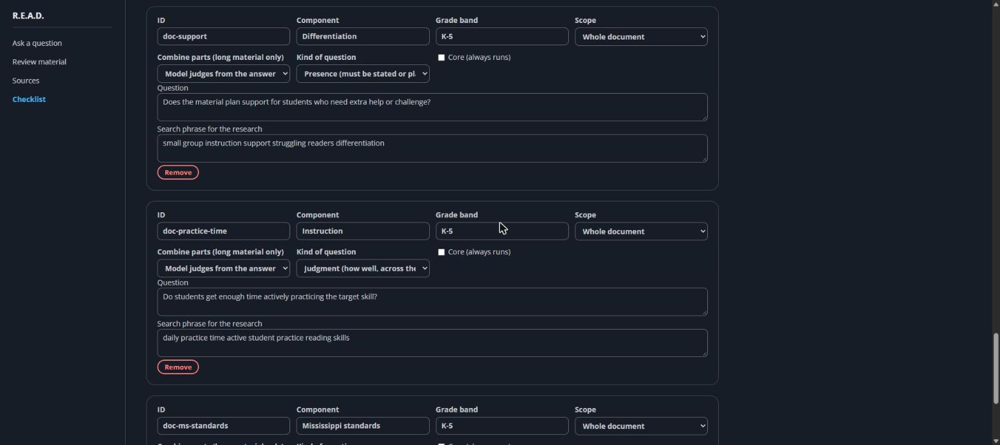 |

| Field | Values | What it controls |
|---|---|---|
| Scope | section · document | Asked per section, or once across the whole material |
| Kind | presence · judgment | **Presence** (objective, check of learning, extra help): must be stated or planned in the material; gets an evidence search and check. **Judgment**: how well, across the material |
| Combine | any · all · judge | How answers from parts of very long material combine |
| Core | true · false | Core questions always run |
| Grade band | e.g. K-3 | Questions outside the material's grade are skipped |
| Search phrase | text | The query used to find research for the question |

### Review material

A teacher uploads sample material (PDF, Word, PowerPoint, text, or pasted text), confirms the
inferred goal, and gets a review: findings for each section, and an **evidence trail** for each
whole-document check. Each trail reads left to right: the material's passage with its key phrase
highlighted, what it shows, the research section scrolled to the cited part, and a conclusion
that weighs one against the other. Partly-met and not-met checks also show how to improve, and
every suggestion stands on a research passage; when the library has none, the page says so and
suggests nothing.

| | |
|---|---|
| 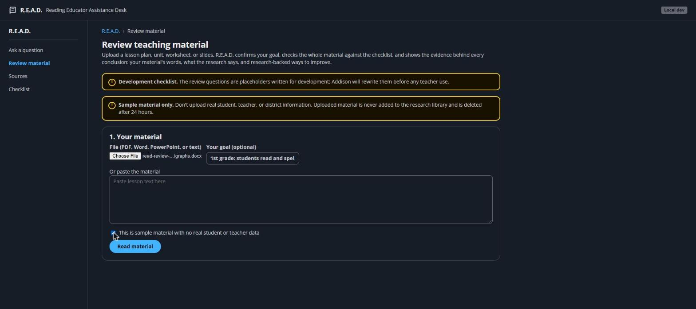 | 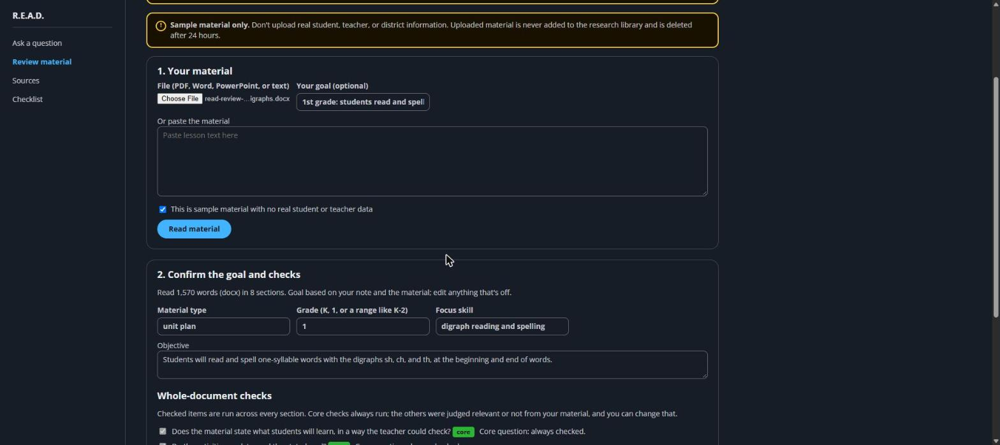 |
| 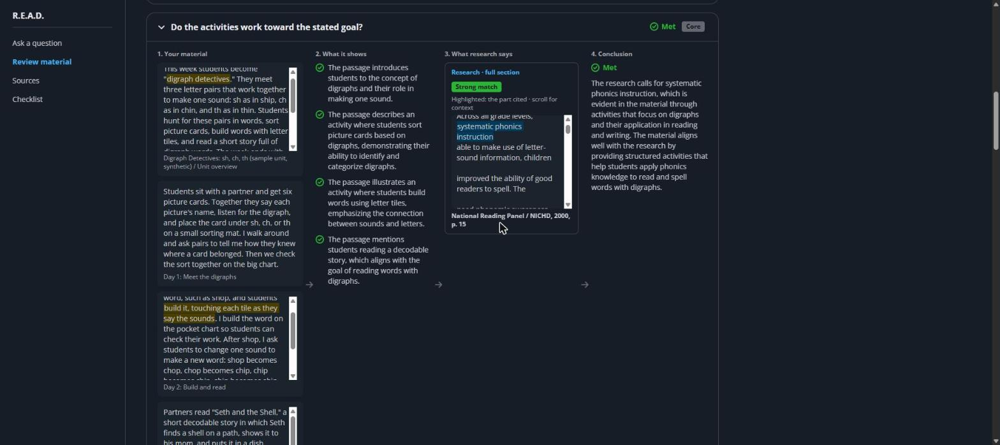 | 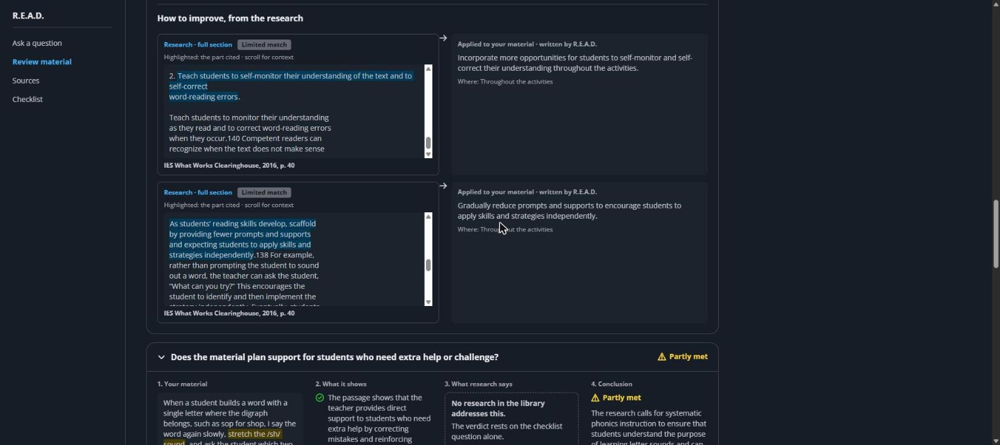 |

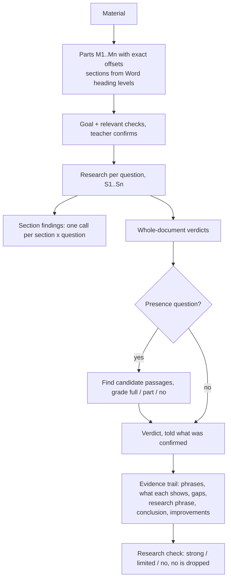

Material up to 25,000 words is read whole for each whole-document check; longer material is
packed into chunks of whole sections and merged.

```python
# src/read/review.py: a phrase is highlighted only if it is really in the stored text
def find_phrase(text: str, phrase: str) -> tuple[int, int] | None:
    words = re.findall(r"\w+", phrase or "")
    if not words or len(words) > PHRASE_MAX_WORDS:
        return None
    gap = r"[\W_]*?(?:-\s+)?"  # punctuation, quotes, spaces, or "stu- dent" between words
    pat = gap.join(r"(?:-\s+)?".join(re.escape(ch) for ch in w) for w in words)
    m = re.search(pat, text, flags=re.I)
    return (m.start(), m.end()) if m else None
```

## Where every word comes from

| On the page | Origin | How it is checked |
|---|---|---|
| Research quotes and sections | Stored source | Sliced by offsets, hash-checked; highlights placed by code |
| Material quotes and highlights | Teacher's upload | Sliced by offsets; highlights placed by code |
| Source names, dates, pages | Metadata | Rendered from `works` and `sections`; the model can't write them |
| Verdicts, "what it shows", conclusions, applied suggestions | Written by R.E.A.D. | Must cite IDs that exist; no 8+ word research reuse outside a quote; labelled as written by R.E.A.D. |
| Research match (strong / limited) | Model grade | Separate check per item; "no" removes the research and anything that leaned on it |

## Measurements

From [`docs/progress.md`](docs/progress.md), on the same 1,570-word synthetic first-grade unit.

| Build | Model calls | Seconds | Notes |
|---|---:|---:|---|
| Review v2 (7 Oct) | 26 | 78 | Rated a missing objective, check of learning, and support as met |
| Five fixes (8 Oct) | 20 | 73 | Goal labelled, Word headings drive sections |
| Hybrid whole-document pass (8 Oct) | 24 | 153 | Single pass up to 25,000 words |
| Per-question section calls (9 Oct) | 76 | 171 | Every section gets feedback |
| Evidence trails (9 Oct) | 109 | 255 | About 45¢ per review |

Size test for the single pass (objective, assessment, and extra-help plan planted at the start,
middle, or end): planted items found 9/9 at 2K words, 7/9 at 10K, 6/9 at 25K, 9/9 at 50K; with
nothing planted, "missing" was correct 11 times out of 12.

## Open issues

- **Verdict stability:** identical runs can disagree on some checks (met vs partly).
- **Placeholder checklist and library:** the expert's questions and licensed sources are pending;
  with four placeholder sources most research matches are "limited", and none covers learning
  objectives.
- **Latency and cost:** about 4 minutes and 45¢ per review; parallel reviews can hit Bedrock
  throttling.
- **Scale:** the in-memory index suits a PoC library; past tens of thousands of passages, move to
  a database (the Aurora version, `pgindex.py`, is kept for a paid-plan account).

## Deploy and run

Requires Python 3.12, the AWS SAM CLI, and an AWS profile allowed by `infra/iam/` (replace
`ACCOUNT_ID` with your own; function roles must carry the `read-poc-boundary` boundary).

```bash
python -m venv .venv && .venv/Scripts/pip install -r requirements.txt -r requirements-dev.txt
pytest
python scripts/build_lambda.py && sam build
sam deploy --stack-name read-poc --capabilities CAPABILITY_IAM --resolve-s3   # review the change set
aws ssm put-parameter --name /read-poc/passcode --type SecureString --value "<passcode>"
python scripts/stack_env.py                   # .env.aws from the stack outputs
python scripts/ingest.py corpus/<file> corpus/<file>.meta.json
python scripts/dev_server.py                  # optional: same app at http://localhost:8080
```

The site is the stack's `ApiUrl` output; the page asks for the passcode once.

Source documents and their license sign-offs are not included. Add your own to `corpus/` with a
`.meta.json` sidecar (fields in `src/read/ingest.py`). A source becomes searchable only after a
person records its license verification.

## Repository layout

| Path | Role |
|---|---|
| `src/read/extract.py` | Format sniffing; PDF, DOCX (with heading levels), PPTX, and text extraction |
| `src/read/chunk.py` | Sections and passages with exact offsets; `verify()` |
| `src/read/retrieve.py` | Score fusion, rerank, section expansion, hash check, reference-list filter |
| `src/read/answer.py` | Answer prompt, forced tool call, validation, verified quotes |
| `src/read/service.py` | `search()` and `answer()`; `Stores.aws()` builds the AWS clients |
| `src/read/s3index.py` | Passages index: S3 shards, in-memory vector + BM25 search |
| `src/read/pgindex.py` | Optional Aurora passages index (paid-plan accounts) |
| `src/read/store.py` | S3 stores (canonical text, temp material, files) |
| `src/read/webapp.py`, `jobs.py` | The web app (pages + API) and the ingest/review jobs |
| `src/handlers/` | Lambda entry points: API, worker, passcode authorizer |
| `template.yaml` | SAM stack: buckets, tables, Lambdas, HTTP API |
| `src/read/review.py`, `review_run.py` | Material review: rules, prompts, validators, evidence trails, pipeline |
| `scripts/` | Dev server, ingest, stack env, Lambda bundle |
| `web/` | The four pages and shared styles (Cloudscape design tokens) |
| `rubric/checklist.json` | The review checklist (development placeholder) |
| `tests/` | Unit tests; Bedrock calls are faked |

The interface uses the design tokens of [Cloudscape](https://cloudscape.design/), AWS's
open-source design system (Apache 2.0). No Amazon or AWS logos are used.

## License

MIT
